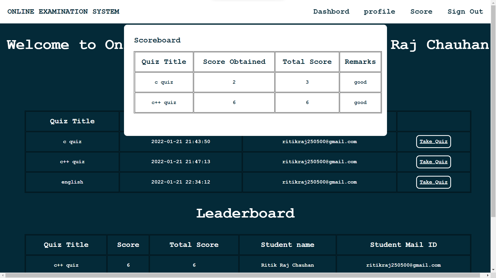

dbms-mini-project
# DBMS project on topic Online Examination System

<b>Technology Used:</b>

<b>Front-End:</b> HTML,CSS,JavaScript

<b>Back-End:</b> PHP,MySql

<b>Link: <a href="https://www.linkedin.com/in/ritikrajchauhan/"> https://www.linkedin.com/in/ritikrajchauhan/</a></b>

<b>Software Used:</b>WAMP

ONLINE EXAMINATION SYSTEM is a web-based examination system where
examinations are given online. either through the internet or intranet using computer
system. The main goal of this online examination system is to effectively evaluate the
student thoroughly through a totally automated system that not only reduce the required
time but also obtain fast and accurate results.

ONLINE EXAMINATION SYSTEM is an online test simulator is to take online
examination, test in an efficient manner and no time wasting for manually checking of the
test paper. The main objective of this web based online examination system is to
efficiently evaluate the student thoroughly through a fully automated system that not only
saves lot of time but also gives fast and accurate results. For students they give papers
according to their convenience from any location by using internet and time and there is
no need of using extra thing like paper, pen etc.

Functional Specification:

1. Registering new Student
2. Getting the student and staff info and storing it to databases
3. Getting the type and number of question paper
4.Generating result after the exam.

<b>Schema Diagram</b>
 
 
 
<b>ER-Diagram</b>

<b>Snapshots</b>

|  |  |  |
| :--------------------------------------: | :--------------------------------------: | :--------------------------------------: |
|  |  |  |
|  |  |  |
|  |  |  |
|  |  |  |

<b>How to run this project locally</b>
1. Clone this repo to www folder in WAMP software
2. Open phpmydmin & Create new database with name projet
3. Import the SQL file present in SQL Files Folder using import option in phpmyadmin.
4. Changes credentials in sql.php file with your database credentials.
5. Open localhost in browser. you see the home page
